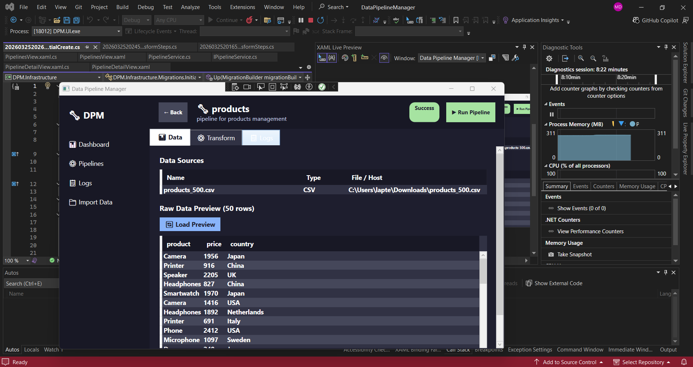

# 🔧 Data Pipeline Manager

A professional desktop application built with **.NET 8 + WPF** that allows users to create, manage, and execute **ETL data pipelines** with a modern dark UI.

> Part of a **Backend & Data Engineering portfolio** — demonstrating clean architecture, ETL workflows, and desktop development.

---

## 📸 Preview



---

## ✨ Features

- 📊 **Dashboard** — overview of all pipelines with status cards
- ⚙️ **Pipeline Management** — create, run, delete pipelines
- 📁 **Multi-source Import** — CSV, TXT, Excel, PostgreSQL, MySQL, Oracle
- 👁️ **Data Preview** — preview 50 rows before importing
- 🔄 **ETL Transformations** — apply LINQ-based transform steps:
  - Filter (Where) with operators `==`, `!=`, `contains`, `>`, `<`, `>=`, `<=`
  - Select Columns
  - OrderBy / OrderByDescending
  - GroupBy + Aggregate (SUM, AVG, COUNT, MIN, MAX)
  - Remove Nulls / Empty rows
  - Trim Spaces
  - Replace Values
  - Change Column Type
- 📋 **Execution Logs** — real-time logs per pipeline
- 🗃️ **Pipeline Detail View** — tabbed interface (Data | Transform | Logs)

---

## 🏗️ Architecture

```
Solution 'DataPipelineManager'
│
├── DPM.Core              → Models + Interfaces (Domain layer)
├── DPM.Infrastructure    → EF Core + SQLite + Readers + Repositories
├── DPM.Application       → Business Logic + Services
└── DPM.UI                → WPF Desktop App (Views + Navigation)
```

### Clean Architecture Pattern
```
DPM.UI (WPF)
    ↓
DPM.Application (Services)
    ↓
DPM.Core (Interfaces + Models)
    ↑
DPM.Infrastructure (EF Core + SQLite)
```

---

## 🛠️ Technologies

| Technology | Usage |
|-----------|-------|
| .NET 8 (C#) | Core framework |
| WPF | Desktop UI (MVVM-ready) |
| Entity Framework Core 8 | ORM |
| SQLite | Local database |
| CsvHelper | CSV/TXT parsing |
| EPPlus | Excel (.xlsx) reading |
| Npgsql | PostgreSQL connector |
| MySql.EntityFrameworkCore | MySQL connector |
| Oracle.EntityFrameworkCore | Oracle connector |

---

## 📂 Project Structure

```
DataPipelineManager/
│
├── DPM.Core/
│   ├── Models/
│   │   ├── Pipeline.cs
│   │   ├── PipelineJob.cs
│   │   ├── ExecutionLog.cs
│   │   ├── DataSource.cs
│   │   └── TransformStep.cs
│   └── Interfaces/
│       ├── IPipelineRepository.cs
│       ├── IPipelineService.cs
│       ├── ITransformService.cs
│       └── IDataSourceReader.cs
│
├── DPM.Infrastructure/
│   ├── Data/
│   │   └── AppDbContext.cs
│   ├── Migrations/
│   ├── Readers/
│   │   ├── CsvReader.cs
│   │   ├── ExcelReader.cs
│   │   └── DatabaseReader.cs
│   └── Repositories/
│       └── PipelineRepository.cs
│
├── DPM.Application/
│   └── Services/
│       ├── PipelineService.cs
│       └── TransformService.cs
│
└── DPM.UI/
    ├── Views/
    │   ├── DashboardView.xaml
    │   ├── PipelinesView.xaml
    │   ├── PipelineDetailView.xaml
    │   ├── ImportDataView.xaml
    │   └── LogsView.xaml
    ├── App.xaml
    └── MainWindow.xaml
```

---

## 🚀 Getting Started

### Prerequisites
- Visual Studio 2022
- .NET 8 SDK
- .NET Desktop Development workload

### Installation

```bash
git clone https://github.com/Dansoko22md/dotnet-data-pipeline-manager.git
cd dotnet-data-pipeline-manager
```

Open `DataPipelineManager.sln` in Visual Studio 2022.

### Run Migrations

```bash
Add-Migration InitialCreate -Project DPM.Infrastructure -StartupProject DPM.UI
Update-Database -Project DPM.Infrastructure -StartupProject DPM.UI
```

### Run the App

Set `DPM.UI` as startup project and press **F5**.

---

## 🧪 Example Workflow

1. Create a pipeline (e.g. `Import Customers`)
2. Attach a CSV data source via **Import Data**
3. Open pipeline detail → **Data** tab → Load Preview
4. Switch to **Transform** tab
5. Add steps: Remove Nulls → Trim Spaces → Filter by country → OrderBy price
6. Click **Apply & Preview** to see transformed data
7. Go back to **Pipelines** → Click **▶ Run** to execute
8. Check **Logs** tab for execution history

---

## 📊 Supported Data Sources

| Source | Status |
|--------|--------|
| CSV | ✅ Supported |
| TXT | ✅ Supported |
| Excel (.xlsx) | ✅ Supported |
| PostgreSQL | ✅ Supported |
| MySQL | ✅ Supported |
| Oracle | ✅ Supported |

---

## 🔮 Future Improvements

- [ ] Scheduling system (cron-like)
- [ ] Export transformed data to CSV/Excel
- [ ] Dashboard charts (bar/line charts)
- [ ] Pipeline templates
- [ ] REST API integration as data source
- [ ] Docker support

---

## 👨‍💻 Moussa Dansoko

Built as a portfolio project demonstrating:
- Desktop development with .NET + WPF
- Clean Architecture (Core / Infrastructure / Application / UI)
- ETL pipeline engineering
- Multi-source data ingestion
- LINQ-based data transformation

---

## 📄 License

MIT License
